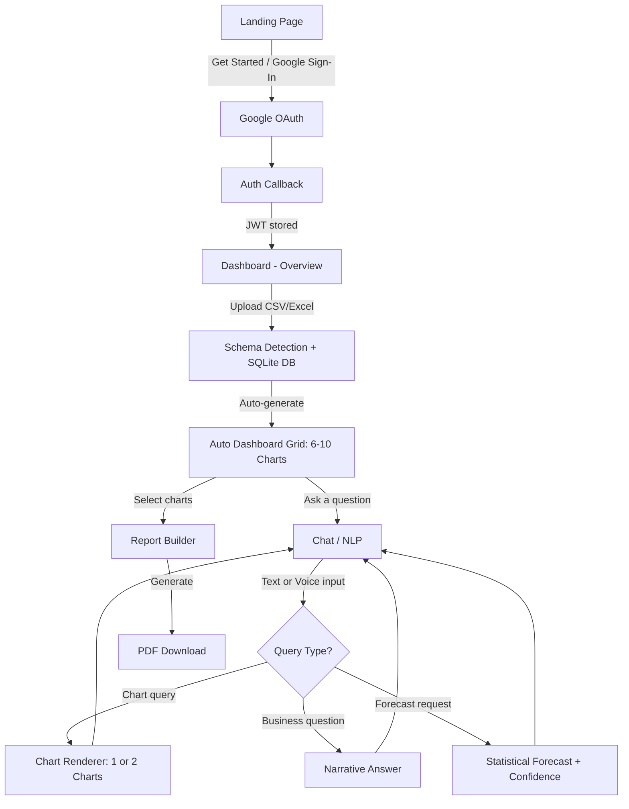

# Frontend Structure Alignment — Narralytics

Align the frontend project structure with the roadmap defined in [NARRALYTICS_FULL_ROADMAP_V2.md](file:///c:/Users/suvam/Desktop/VS%20code/Projects/Narralytics/reference/NARRALYTICS_FULL_ROADMAP_V2.md), ensuring each module is represented in the folder structure and routing system.

---

## Roadmap Analysis

### 6 Major Product Modules

| Module | Scope | Roadmap Phase |
|--------|-------|---------------|
| **MODULE 1: Auth** | Google OAuth 2.0, JWT, user profile in MongoDB | Phase 1 |
| **MODULE 2: Dataset Upload** | CSV/Excel upload, schema detection, SQLite creation, per-user isolation | Phase 1 |
| **MODULE 3: Auto Dashboard** | LLM generates 6–10 chart specs from schema, full dashboard grid on first load | Phase 2 |
| **MODULE 4: Chat + NLP** | Text/voice input, voice output, output count selector (1 or 2 charts), conversation context, follow-ups | Phase 3 |
| **MODULE 5: Forecasting** | Chat-only, explicit requests only, statistical extrapolation, confidence range | Phase 4 |
| **MODULE 6: PDF Reports** | Chart selection → LLM executive summary → PDF download | Phase 5 |

### Sub-Features per Module

**Auth**
- Google OAuth redirect + callback
- JWT token issuance + frontend storage
- Protected route guard
- User profile display (name, picture, email)

**Dataset Upload**
- Drag-and-drop CSV/Excel uploader ([UploadZone](file:///c:/Users/suvam/Desktop/VS%20code/Projects/Narralytics/reference/web-pages/Dashboard.jsx#602-645))
- Dataset list/selector (`DatasetSelector`)
- Schema detection feedback
- Multiple datasets per user with switching

**Auto Dashboard**
- Auto-generated chart grid (6–10 charts)
- Chart types: area, bar, line, pie, scatter
- "View Query" toggle per chart (SQL visibility)
- Business insight sentence per chart
- Loading/skeleton states

**Chat + NLP Interaction**
- Chat conversation thread (`ChatWindow`, `ChatMessage`)
- Voice input via Web Speech API (`VoiceButton`)
- Voice output via SpeechSynthesis
- Output count toggle: 1 or 2 charts (`OutputToggle`)
- Conversation history (last 10 turns)
- Follow-up refinement

**Forecasting**
- Triggered from chat only (no dedicated page)
- Forecast chart with confidence intervals
- Distinctly labeled "Forecast — Not Historical Data"

**PDF Report**
- Chart selection checklist
- Report builder page
- PDF download trigger
- Executive summary auto-generation

### Page-Level Functionality

| Page | Route | Auth | Module(s) |
|------|-------|------|-----------|
| **Landing** | `/` | Public | Marketing, onboarding |
| **Auth Callback** | `/auth/callback` | Public | Auth (OAuth redirect handler) |
| **Dashboard** | `/dashboard` | Protected | Modules 2, 3 (upload + auto charts) |
| **Chat** | `/chat` | Protected | Modules 4, 5 (NLP + forecasting) |
| **Reports** | `/reports` | Protected | Module 6 (PDF builder) |

### Dashboard Sections (Internal Tabs)

The Dashboard page uses an internal sidebar navigation with tabs:

| Tab ID | Label | Description | Status |
|--------|-------|-------------|--------|
| `overview` | Overview | KPI cards + trend charts + upload + chat preview + activity feed | ✅ Implemented in reference |
| `analytics` | Analytics | Deep-dive analytics (coming soon placeholder) | Stub |
| `datasets` | Datasets | Dataset manager (coming soon placeholder) | Stub |
| `chat` | AI Chat | Chat assistant (coming soon placeholder — separate page) | Stub |
| `insights` | Insights | AI insights (coming soon placeholder) | Stub |
| `reports` | Reports | PDF reports (coming soon placeholder — separate page) | Stub |
| `alerts` | Alerts | Alerts & monitoring (coming soon placeholder) | Stub |
| `settings` | Settings | User settings (coming soon placeholder) | Stub |

### User Flows



### Existing Reference Pages Inventory

| File | Component | Content | Embeddable Components |
|------|-----------|---------|----------------------|
| [Landing.jsx](file:///c:/Users/suvam/Desktop/VS code/Projects/Narralytics/reference/web-pages/Landing.jsx) | [Landing](file:///c:/Users/suvam/Desktop/VS%20code/Projects/Narralytics/reference/web-pages/Landing.jsx#952-980) | Full marketing landing page: hero with Three.js neural network, features grid, how-it-works steps, stats section, CTA/pricing, footer | [NavBar](file:///c:/Users/suvam/Desktop/VS%20code/Projects/Narralytics/reference/web-pages/Landing.jsx#453-548), [Hero](file:///c:/Users/suvam/Desktop/VS%20code/Projects/Narralytics/reference/web-pages/Landing.jsx#549-703), [NeuralNetCanvas](file:///c:/Users/suvam/Desktop/VS%20code/Projects/Narralytics/reference/web-pages/Landing.jsx#148-289), [FeaturesSection](file:///c:/Users/suvam/Desktop/VS%20code/Projects/Narralytics/reference/web-pages/Landing.jsx#704-751), [HowItWorks](file:///c:/Users/suvam/Desktop/VS%20code/Projects/Narralytics/reference/web-pages/Landing.jsx#752-780), [Stats](file:///c:/Users/suvam/Desktop/VS%20code/Projects/Narralytics/reference/web-pages/Landing.jsx#781-805), [CTASection](file:///c:/Users/suvam/Desktop/VS%20code/Projects/Narralytics/reference/web-pages/Landing.jsx#806-902), [Footer](file:///c:/Users/suvam/Desktop/VS%20code/Projects/Narralytics/reference/web-pages/Landing.jsx#903-951), reusable: [BtnPrimary](file:///c:/Users/suvam/Desktop/VS%20code/Projects/Narralytics/reference/web-pages/Landing.jsx#320-336), [BtnGhost](file:///c:/Users/suvam/Desktop/VS%20code/Projects/Narralytics/reference/web-pages/Landing.jsx#337-355), [FeatureCard](file:///c:/Users/suvam/Desktop/VS%20code/Projects/Narralytics/reference/web-pages/Landing.jsx#356-391), [StepCard](file:///c:/Users/suvam/Desktop/VS%20code/Projects/Narralytics/reference/web-pages/Landing.jsx#392-426), [StatCard](file:///c:/Users/suvam/Desktop/VS%20code/Projects/Narralytics/reference/web-pages/Landing.jsx#427-452), [EyebrowLabel](file:///c:/Users/suvam/Desktop/VS%20code/Projects/Narralytics/reference/web-pages/Landing.jsx#292-304), [SectionTitle](file:///c:/Users/suvam/Desktop/VS%20code/Projects/Narralytics/reference/web-pages/Landing.jsx#305-319) |
| [Dashboard.jsx](file:///c:/Users/suvam/Desktop/VS code/Projects/Narralytics/reference/web-pages/Dashboard.jsx) | [Dashboard](file:///c:/Users/suvam/Desktop/VS%20code/Projects/Narralytics/reference/web-pages/Dashboard.jsx#1002-1057) | Complete dashboard workspace: sidebar, top nav, overview page with KPI cards, 4 chart types (area, bar, line, pie), upload zone, chat preview, activity feed, data pipelines, recent queries table | [Sidebar](file:///c:/Users/suvam/Desktop/VS%20code/Projects/Narralytics/reference/web-pages/Dashboard.jsx#321-445), [TopNav](file:///c:/Users/suvam/Desktop/VS%20code/Projects/Narralytics/reference/web-pages/Dashboard.jsx#446-601), [OverviewPage](file:///c:/Users/suvam/Desktop/VS%20code/Projects/Narralytics/reference/web-pages/Dashboard.jsx#699-979), [UploadZone](file:///c:/Users/suvam/Desktop/VS%20code/Projects/Narralytics/reference/web-pages/Dashboard.jsx#602-645), [ChatPreview](file:///c:/Users/suvam/Desktop/VS%20code/Projects/Narralytics/reference/web-pages/Dashboard.jsx#646-698), [ComingSoon](file:///c:/Users/suvam/Desktop/VS%20code/Projects/Narralytics/reference/web-pages/Dashboard.jsx#980-1001), [KPICard](file:///c:/Users/suvam/Desktop/VS%20code/Projects/Narralytics/reference/web-pages/Dashboard.jsx#238-284), [CardHeader](file:///c:/Users/suvam/Desktop/VS%20code/Projects/Narralytics/reference/web-pages/Dashboard.jsx#285-297), [Badge](file:///c:/Users/suvam/Desktop/VS%20code/Projects/Narralytics/reference/web-pages/Dashboard.jsx#218-237), [ChartTip](file:///c:/Users/suvam/Desktop/VS%20code/Projects/Narralytics/reference/web-pages/Dashboard.jsx#192-212), [Skeleton](file:///c:/Users/suvam/Desktop/VS%20code/Projects/Narralytics/reference/web-pages/Dashboard.jsx#213-217), [IconBtn](file:///c:/Users/suvam/Desktop/VS%20code/Projects/Narralytics/reference/web-pages/Dashboard.jsx#298-320) |

---

## Proposed Changes

### Frontend Project Scaffold

> [!IMPORTANT]
> The frontend has **not been initialized yet** — the project currently contains only `backend/` and `reference/`. We need to scaffold a new Vite + React project in `frontend/`.

#### [NEW] Frontend Project (`frontend/`)

Initialize with Vite + React:
```bash
npx -y create-vite@latest ./ -- --template react
```

Install required dependencies:
```bash
npm install react-router-dom recharts lucide-react three
```

---

### Frontend Folder Structure

```
frontend/
├── index.html
├── vite.config.js
├── package.json
├── .env.development                     ← VITE_API_URL, VITE_GOOGLE_CLIENT_ID
│
└── src/
    ├── main.jsx                         ← ReactDOM.render + BrowserRouter
    ├── App.jsx                          ← Route definitions + AuthProvider
    ├── index.css                        ← Global reset, CSS variables, fonts
    │
    ├── config/
    │   └── theme.js                     ← Theme tokens (dark/light) extracted
    │
    ├── context/
    │   └── AuthContext.jsx              ← Auth provider: JWT storage, user state
    │
    ├── hooks/
    │   ├── useAuth.js                   ← Login, logout, token management
    │   ├── useDashboard.js              ← Auto-dashboard API calls
    │   ├── useChat.js                   ← Chat API calls + history
    │   └── useVoice.js                  ← Web Speech API (STT + TTS)
    │
    ├── pages/
    │   ├── Landing.jsx                  ← FROM reference/web-pages/Landing.jsx
    │   ├── AuthCallback.jsx             ← [NEW] OAuth redirect handler
    │   ├── Dashboard.jsx                ← FROM reference/web-pages/Dashboard.jsx
    │   ├── Chat.jsx                     ← [NEW] Full chat page
    │   └── Reports.jsx                  ← [NEW] Report builder page
    │
    ├── components/
    │   ├── common/
    │   │   ├── Skeleton.jsx             ← Extract from Dashboard
    │   │   ├── Badge.jsx                ← Extract from Dashboard
    │   │   ├── IconBtn.jsx              ← Extract from Dashboard
    │   │   └── CardHeader.jsx           ← Extract from Dashboard
    │   │
    │   ├── layout/
    │   │   ├── Sidebar.jsx              ← Extract from Dashboard
    │   │   └── TopNav.jsx               ← Extract from Dashboard
    │   │
    │   ├── landing/
    │   │   ├── NavBar.jsx               ← Extract from Landing
    │   │   ├── Hero.jsx                 ← Extract from Landing
    │   │   ├── NeuralNetCanvas.jsx      ← Extract from Landing
    │   │   ├── FeaturesSection.jsx      ← Extract from Landing
    │   │   ├── HowItWorks.jsx           ← Extract from Landing
    │   │   ├── Stats.jsx                ← Extract from Landing
    │   │   ├── CTASection.jsx           ← Extract from Landing
    │   │   └── Footer.jsx              ← Extract from Landing
    │   │
    │   ├── upload/
    │   │   ├── UploadZone.jsx           ← Extract from Dashboard
    │   │   └── DatasetSelector.jsx      ← [NEW] Switch between datasets
    │   │
    │   ├── charts/
    │   │   ├── ChartRenderer.jsx        ← [NEW] Recharts switch by type
    │   │   ├── ChartSelector.jsx        ← [NEW] Dual-option UX (output_count=2)
    │   │   ├── ChartCard.jsx            ← [NEW] Confirmed chart on canvas
    │   │   ├── ChartTip.jsx             ← Extract from Dashboard
    │   │   └── AutoDashboard.jsx        ← [NEW] Full auto-generated grid
    │   │
    │   ├── chat/
    │   │   ├── ChatWindow.jsx           ← [NEW] Conversation thread
    │   │   ├── ChatMessage.jsx          ← [NEW] Single message bubble
    │   │   ├── VoiceButton.jsx          ← FROM roadmap code (Step 10)
    │   │   └── OutputToggle.jsx         ← [NEW] 1 or 2 output selector
    │   │
    │   ├── dashboard/
    │   │   ├── KPICard.jsx              ← Extract from Dashboard
    │   │   ├── OverviewPage.jsx         ← Extract from Dashboard
    │   │   ├── ChatPreview.jsx          ← Extract from Dashboard
    │   │   └── ComingSoon.jsx           ← Extract from Dashboard
    │   │
    │   └── report/
    │       └── ReportBuilder.jsx        ← [NEW] Chart selection + PDF trigger
    │
    └── styles/
        ├── landing.css                  ← Extracted from Landing.jsx GLOBAL_CSS
        └── dashboard.css                ← Extracted from Dashboard.jsx DASH_CSS
```

---

### Routing System

#### [NEW] [App.jsx](file:///c:/Users/suvam/Desktop/VS code/Projects/Narralytics/frontend/src/App.jsx)

```jsx
// Route map
<Routes>
  <Route path="/"              element={<Landing />} />
  <Route path="/auth/callback"  element={<AuthCallback />} />
  <Route path="/dashboard"      element={<ProtectedRoute><Dashboard /></ProtectedRoute>} />
  <Route path="/chat"           element={<ProtectedRoute><Chat /></ProtectedRoute>} />
  <Route path="/reports"        element={<ProtectedRoute><Reports /></ProtectedRoute>} />
</Routes>
```

#### [NEW] [AuthCallback.jsx](file:///c:/Users/suvam/Desktop/VS code/Projects/Narralytics/frontend/src/pages/AuthCallback.jsx)

Extracts JWT from URL fragment `#token=...`, stores in `localStorage`, and redirects to `/dashboard`.

---

### Connecting Reference Pages

| Reference File | Target Location | Strategy |
|----------------|-----------------|----------|
| [Landing.jsx](file:///c:/Users/suvam/Desktop/VS%20code/Projects/Narralytics/reference/web-pages/Landing.jsx) | `src/pages/Landing.jsx` | Copy as-is, update `onGetStarted` to use `react-router-dom` `navigate` |
| [Dashboard.jsx](file:///c:/Users/suvam/Desktop/VS%20code/Projects/Narralytics/reference/web-pages/Dashboard.jsx) | `src/pages/Dashboard.jsx` | Copy as-is, wire sidebar `chat` to `navigate('/chat')`, wire `reports` to `navigate('/reports')` |

Both reference files are self-contained with their own style injectors and theme tokens. They will work immediately as full pages.

---

## Verification Plan

### Automated Tests

Since this is a structural scaffolding task (creating folders, files, and route wiring), the primary verification is:

1. **Vite dev server starts successfully**
   ```bash
   cd frontend && npm run dev
   ```
   Verify no build/compilation errors.

2. **All routes resolve without errors** — Browser test:
   - Navigate to `http://localhost:5173/` → Landing page renders
   - Navigate to `http://localhost:5173/dashboard` → Dashboard page renders  
   - Navigate to `http://localhost:5173/chat` → Chat page renders (stub or placeholder)
   - Navigate to `http://localhost:5173/reports` → Reports page renders (stub)
   - Navigate to `http://localhost:5173/auth/callback` → Auth callback page renders

### Manual Verification

> [!NOTE]
> After scaffolding, the user should visually verify:
> 1. Landing page renders identically to the reference file (3D neural network, theme toggle, all sections)
> 2. Dashboard page renders with sidebar, top nav, and overview page with all charts
> 3. Theme toggle (dark/light) works on both pages
> 4. "Get Started" on Landing navigates to Dashboard
> 5. Sidebar navigation on Dashboard works for all tabs
